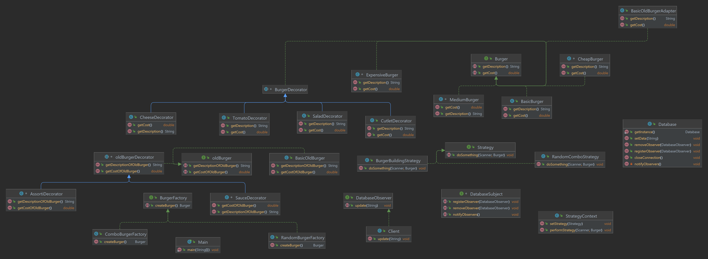

# BurgerProject

BurgerProject is a Java-based project designed to optimize the operation of a burger establishment. The program provides various features, such as creating custom burgers and receiving random combos. It operates in a terminal environment, requiring user input for interaction.

## Features

### 1. Custom Burger Creation

Users can create custom burgers by selecting the type of burger and choosing ingredients to suit their taste. This functionality is implemented using the Decorator pattern, allowing the addition of new layers (ingredients) to the burger.

### 2. Random Combo Generation

Users can receive random combos of different price categories, including both cheap and expensive combos. The randomness is influenced by luck, and the project provides two types of probabilities: completely random and customized. The administrator can choose the desired probability type. This functionality is implemented using the Factory pattern, allowing the initialization of different combos with different probabilities.

## Design Patterns

### Decorator Pattern

The Decorator pattern is utilized to enable users to customize burgers by adding layers of ingredients.

### Factory Pattern

The Factory pattern is employed to generate random combos with different probabilities, providing flexibility in initializing combos.

### Strategy Pattern

The Strategy pattern is introduced to allow users, based on their choice, to perform various actions provided by the program. The complete isolation of different algorithms enhances the application's flexibility.

### Singleton Pattern

The Singleton pattern ensures the initialization of a single database, preventing the instantiation of another database for improved program operation.

### Observer Pattern

The Observer pattern is implemented to notify administrators of user orders. This real-time update functionality provides an advantage in restaurant operations.

### Adapter Pattern

The Adapter pattern is used to seamlessly integrate the old system into the new one, avoiding a complete code rewrite. This partial supplementation helps save resources.

## Usage

To interact with the program, run the `Main` class. Follow the prompts to create custom burgers or receive random combos.

## Contribution

Happy burger crafting! 🍔🛠️

# UML Diagram

